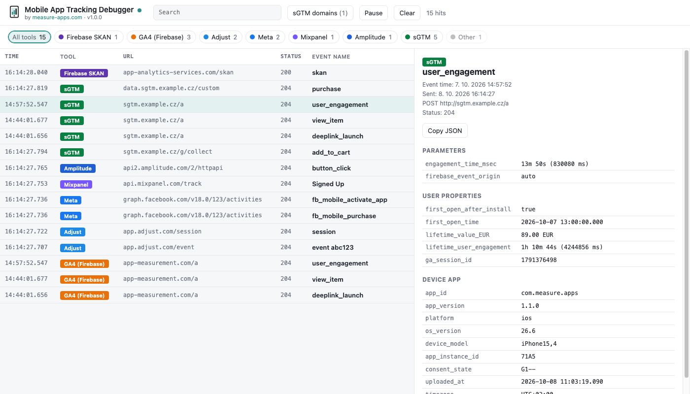

# Mobile App Tracking Debugger

A tool for QA-ing the outgoing analytics hits of a mobile app, built on top of [mitmproxy](https://www.mitmproxy.org/).

See every tracking hit your app sends, grouped by tool, one row per event. GA4 / Firebase hits, which are binary protobuf and unreadable in any proxy, are decoded into plain events and parameters.

> **iOS only.** The GA4 decoder works with apps running on iOS.



## Features

- **Live hits list** on http://127.0.0.1:8082, opens automatically with mitmweb
- **Tool detection** by domain, with a filter per tool: GA4 (Firebase), GA4 (web), Firebase, Crashlytics, Adjust, AppsFlyer, Meta, Branch, Singular, Kochava, Airbridge, TikTok, Snapchat, Google Ads, Mixpanel, Amplitude, Segment, Braze, CleverTap, OneSignal, AppMetrica, RevenueCat, Sentry, Datadog, Clarity
- **One row per event** – batched requests (GA4, Meta, Amplitude, Mixpanel, ...) are split into single events
- **Regex search** across event names, URLs, status codes and parameters
- **GA4 decoding** – Firebase short names translated (`_e` → `user_engagement`, `_et` → `engagement_time_msec`, ...), readable values (dates, durations, LTV in currency), ecommerce `items[]`, user properties, device & app info
- **Firebase validation errors** – see when the SDK drops a parameter (e.g. value longer than 100 characters)
- **Server-side GTM detection** – read from the app's Firebase config, see below
- **Firebase config** – measurement ID, key events, sGTM endpoint and SDK limits
- **Firebase SKAN** requests decoded
- **Other binary payloads** decoded as schema-less protobuf
- **mitmweb views** – the same decoding is available directly in mitmweb's request/response view
- **No dependencies** – a single Python file, works with the official mitmproxy installers

## GA4 decoding

Most tracking hits are readable in a proxy as they are (JSON or query strings). GA4 is different: the Firebase Analytics SDK sends events to `app-measurement.com/a` as compressed binary protobuf, so you only see gibberish. The addon decodes it. This is how a GA4 request looks in mitmweb:

```yaml
# 3 event(s): deeplink_launch, view_item, user_engagement
events:

  - event: deeplink_launch
    time: 2026-10-07 14:44:01.656
    params:
      deeplink_destination: /shop/product/trail-runner-pro-x3
      firebase_event_origin: app
      firebase_error_value: deeplink_url_referrer
      firebase_error_length: 130
      firebase_error: 4 (parameter value too long)

  - event: view_item
    time: 2026-10-07 14:44:01.677
    params:
      currency: EUR
      value: 89
      items:
        - item_id: trail-runner-pro-x3
          item_name: Trail Runner Pro X3
          price: 89
          quantity: 1

  - event: user_engagement
    time: 2026-10-07 14:57:52.547
    params:
      engagement_time_msec: 13m 50s (830080 ms)
      firebase_event_origin: auto

user_properties:
  first_open_after_install: true
  lifetime_value_EUR: 89.00 EUR
  ga_session_id: 1791376498

device_app:
  app_id: com.example.app
  platform: ios
  os_version: 26.6
  consent_state: G1--
  timezone: UTC+02:00
```

## Server-side GTM

On start, the Firebase SDK downloads its measurement config from `app-measurement.com/config/app/<firebase app id>`. The addon decodes it, finds the server-side GTM endpoint (if the app uses one) and remembers its domain. The **sGTM domains** panel opens with the domain filled in.

Hits sent to that domain are shown as **sGTM** and GA4 payloads in them are decoded like the ones sent to Google. Any URL with `app-measurement` on a non-Google domain counts as sGTM as well.

If the SDK has the config cached and doesn't download it again, add the domain by hand under **sGTM domains**. Hover the button to see the remembered domains; **Forget domains** clears them.

## Installation

### macOS

**1. Install mitmproxy** (version 12 or newer) using [Homebrew](https://brew.sh):

```bash
brew install --cask mitmproxy
```

No Homebrew? Download the installer from [mitmproxy.org/downloads](https://mitmproxy.org/downloads/).

**2. Install the addon:**

```bash
curl -fsSL https://github.com/michalnovacek96/mitmproxy/releases/latest/download/install.sh | bash
```

This downloads the latest release to `~/.mitmproxy/addons/` and registers it in `~/.mitmproxy/config.yaml`, so it loads every time you start `mitmweb`.

### Windows

**1. Install mitmproxy** (version 12 or newer) – download and run the Windows installer from [mitmproxy.org/downloads](https://mitmproxy.org/downloads/).

**2. Install the addon:**

1. Download [`app_tracking_debugger.py`](https://github.com/michalnovacek96/mitmproxy/releases/latest/download/app_tracking_debugger.py) from the latest release.
2. Create the file `%USERPROFILE%\.mitmproxy\config.yaml` with this content (use the path where you saved the file):

   ```yaml
   scripts:
     - C:\Users\<you>\Downloads\app_tracking_debugger.py
   ```

Alternatively, skip the config and start mitmweb with the script each time:

```powershell
mitmweb -s C:\Users\<you>\Downloads\app_tracking_debugger.py
```

### Updating

Run the install command again (macOS) or download the file again (Windows). The installed version is shown in the UI header under the title. See [CHANGELOG.md](CHANGELOG.md) for what changed.

## Usage

1. Start `mitmweb`. The hits UI opens in your browser at http://127.0.0.1:8082 (mitmweb itself stays available on http://127.0.0.1:8081).
2. Find your computer's local IP address (the iPhone must be on the same Wi-Fi):
   - **macOS** (Terminal):
     ```bash
     ipconfig getifaddr en0 || ipconfig getifaddr en1
     ```
   - **Windows** (PowerShell):
     ```powershell
     (Get-NetIPConfiguration | Where-Object { $_.IPv4DefaultGateway }).IPv4Address.IPAddress
     ```
   - Or in the system network settings (Wi-Fi / Network → Details → IP address).
3. On the iPhone: Settings → Wi-Fi → (i) next to your network → Configure Proxy → **Manual**. Server = your computer's IP (e.g. `192.168.1.20`), Port = `8080`.
4. Open **http://mitm.it** on the iPhone and install the mitmproxy certificate: Settings → General → VPN & Device Management → install, then Settings → General → About → Certificate Trust Settings → enable.
5. Use the app. The hits appear live.

When you're done, set the iPhone's proxy back to **Off**, otherwise it has no internet on that Wi-Fi.

In mitmweb itself (http://127.0.0.1:8081) tracking requests are marked; filter them with `~marked`.

### Options

| Option | Default | |
|---|---|---|
| `tracking_ui_port` | `8082` | Port of the hits UI, `0` turns it off |
| `tracking_ui_open` | `true` | Open the hits UI in the browser when mitmweb starts |
| `web_open_browser` | `false` (set by the installer) | mitmweb's own option – whether mitmweb also opens its own page on start |

Example: `mitmweb --set tracking_ui_open=false`

## Limitations

- The GA4 protobuf schema is community reverse-engineered and not complete. Unknown fields are shown as `unknown_<number>` or hidden. Contributions are welcome at [lari/firebase-ga4-app-measurement-protobuf](https://github.com/lari/firebase-ga4-app-measurement-protobuf).
- Tool detection is domain based. If an SDK uses a domain that isn't on the list, its hits end up under **Other**. Please open an issue with the domain.
- Hits are kept in memory only (last 5,000) and are cleared when mitmweb restarts.

## Releasing (for maintainers)

1. Bump `__version__` in `app_tracking_debugger.py` and add a section to `CHANGELOG.md`.
2. Commit, then tag and push:
   ```bash
   git tag v1.1.0
   git push origin main --tags
   ```
3. The GitHub Action creates the release with `app_tracking_debugger.py` and `install.sh` attached. The install command always fetches the latest release.

## Credits

- Built by [measure-apps.com](https://www.measure-apps.com)
- Protobuf schema: [lari/firebase-ga4-app-measurement-protobuf](https://github.com/lari/firebase-ga4-app-measurement-protobuf) by Lari Haataja (MIT)
- [mitmproxy](https://www.mitmproxy.org/)

## License

MIT
